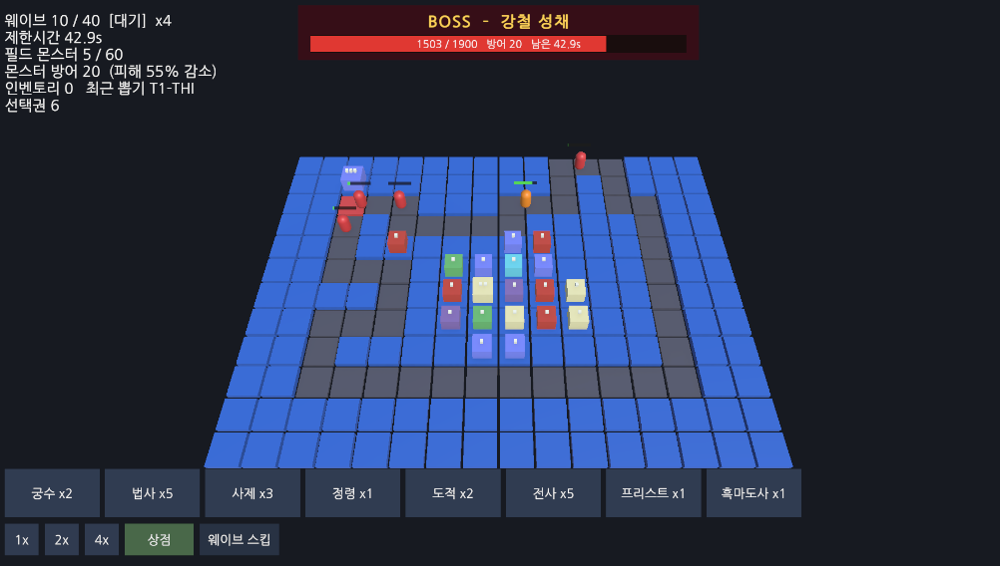
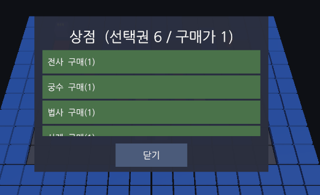
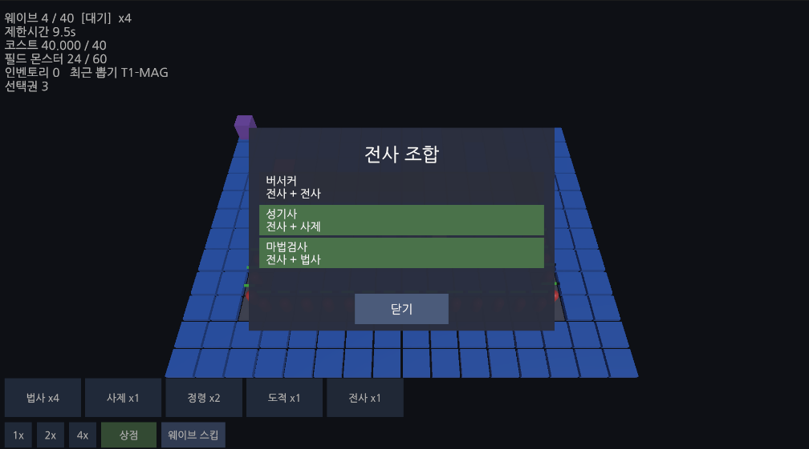
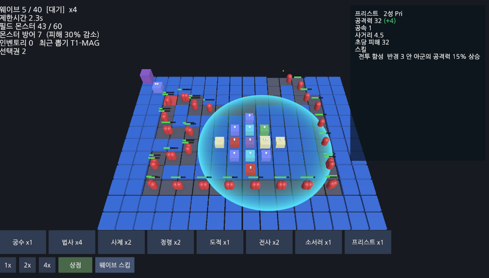
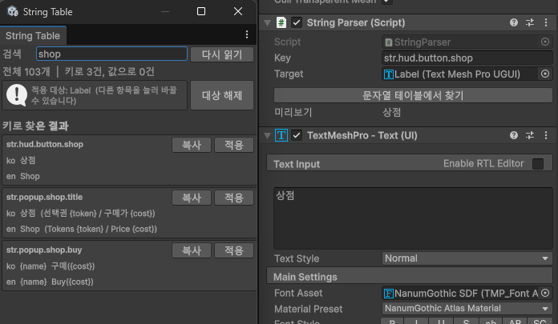
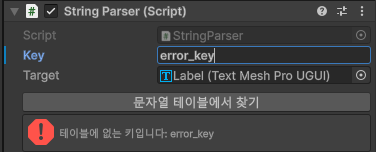

# SYNTHESIS (가칭)

랜덤 조합 디펜스 로그라이트. Unity / URP / C# 1인 개발.

루프형 폐곡선 맵을 순회하는 몬스터를, 뽑기로 받은 1성 유닛을 합성해 만든 상위 유닛으로 처리합니다.
10의 배수 라운드가 보스이고, 제한시간 내에 처리하지 못하거나 필드 누적 몬스터가 상한을 넘으면 패배합니다.

---

## 먼저 알아야 할 것

**이 저장소는 완성된 게임이 아니라 진행 중인 그레이박스 프로토타입입니다.**

아트가 하나도 없습니다. 유닛과 몬스터는 Unity 기본 캡슐과 큐브이고, 텍스처와 모델 파일은 0개입니다.
UI는 TextMeshPro와 한글 폰트(나눔고딕)로 글자만 읽히게 맞춘 그레이박스이고 스타일링은 하지 않았습니다.
이건 미룬 것이 아니라 로드맵에 박아 둔 규칙입니다
(ROADMAP.md 0장, "STEP 8 이전에는 아트 비용을 한 푼도 쓰지 않는다").
STEP 3, 4, 7, 8에 게이트를 두고, 그 판정을 통과하기 전에는 아트와 마케팅에 자원을 넣지 않습니다.

그래서 이 저장소가 증명하려는 것은 룩이 아니라 아래 셋입니다.

1. Unity 없이 돌아가는 순수 C# 코어와 그 위에 세운 결정성 규칙
2. 규칙을 문서에만 두지 않고 린터와 테스트로 커밋마다 강제하는 검증 파이프라인
3. 설계가 틀렸을 때 무엇을 근거로 경계를 다시 그었는가

렌더링과 셰이더 작업물, 실무 기반 시스템과 재사용 패키지는 별도 저장소에 있습니다.
[frenil-portfolio](https://github.com/Frenil-client/frenil-portfolio)에 정리해 두었습니다.

---

## 지금 돌아가는 것

### 웨이브 전투



화면에서 읽을 수 있는 것들을 적어 둡니다.

- **1x / 2x / 4x 배속.** `Time.timeScale`이 아니라 고정 틱 누산기를 더 빨리 소비하는 방식입니다.
  Core 틱은 초당 20회, 1틱 50ms로 고정이고 배속은 초당 소비하는 틱 수만 바꿉니다.
  덕분에 Core가 소유한 스폰, 루프 순회, 배치는 프레임레이트와 배속에 무관하게
  같은 틱 수열을 밟습니다. 다만 전투는 실시간이라 이 보장 밖입니다 (아래 "책임 경계 재설계").
- **필드 몬스터 5 / 60.** 누적 상한 패배 조건이 HUD에 상시 노출됩니다. 규칙이 문서에만 있는 것이 아니라
  플레이어가 읽는 자리까지 내려와 있습니다.
- **웨이브 10 / 40, 제한시간 42.9s.** 40웨이브 구조와 웨이브별 제한시간이고, 10의 배수가 보스입니다.
  위 스샷은 보스 웨이브라 화면 상단 중앙에 보스전 배너가 떠 있습니다. 보스 이름과 남은 체력바를
  방어력, 남은 시간과 함께 따로 강조합니다("BOSS - 강철 성채  1503 / 1900  방어 20").
- **몬스터 방어 20 (피해 55% 감소).** 방어력은 보스 전용이 아니라 일반 몬스터도 원형별로 갖습니다.
  수치만 적으면 그게 얼마나 아픈지 읽히지 않으므로 감소율을 함께 냅니다.
  이 감소율은 전투가 실제로 쓰는 공식을 그대로 호출한 값입니다(아래 "유닛 조작과 전투").
- **배치에 드는 자원이 없습니다.** HUD에 코스트 줄이 없는 이유입니다. 한때 코스트 경제가 있었지만
  회복이 소모를 크게 웃돌아 아무것도 제약하지 않아 폐기했습니다. 한정 자원은 배치 칸 수뿐입니다.
- **계열별 단색 + HP바.** 텍스처 없이 읽히게 만들기 위한 선택입니다.
  6개 계열(전사, 궁수, 법사, 사제, 도적, 정령)에 머티리얼 색을 하나씩 할당했습니다.

### 상점과 선택권



랜덤 조합 디펜스의 실패 지점은 특정 재료가 안 떠서 조합이 막히는 순간입니다.
뽑기 자체에는 천장이나 보장 규칙을 두지 않는 대신, 석상 파괴와 보스 보상으로 얻는
**선택권**이라는 재화로 분산을 통제합니다. 상점에서 선택권을 내면 원하는 1성을 정확히 살 수 있습니다.
(현재 임시값으로 석상 1기 파괴가 선택권 3개, 1성 구매가 선택권 1개입니다. 수치는 이후 시뮬로 확정합니다.)

랜덤성을 뽑기 확률로 손보면 운이 좋은 런과 나쁜 런의 편차만 줄어들고 플레이어가 개입할 여지는 없습니다.
획득을 행동(석상 파괴, 보스 처치)에 묶으면 "지금 막혔으니 저 석상을 먼저 깬다"는 결정이 생깁니다.
그래서 확률이 아니라 재화를 골랐습니다.

### 조합



유닛을 누르면 그 유닛이 **대표(첫) 재료로 들어가는 조합식만** 보여줍니다.
전사를 누르면 버서커(전사 + 전사), 성기사(전사 + 사제), 마법검사(전사 + 법사)가 뜨고,
법사가 첫 재료인 주술사(법사 + 정령)는 전사 목록이 아니라 법사 목록에 나옵니다.
같은 조합식을 재료마다 중복으로 띄우지 않고 대표 재료 한 곳에만 노출하려는 규칙입니다.
지금 보유분으로 즉시 가능한 것은 초록으로 구분하고, 조합을 실행하면 팝업이 결과 유닛 기준으로
전환되어 연쇄 조합을 이어서 볼 수 있습니다. 목록이 길면 스크롤되고, 유닛 ID 없이 이름만 표시합니다.

조합식은 코드에 하드코딩하지 않고 `Data/recipes.csv` 36행이 원본입니다.
결과 기준으로는 딕셔너리 인덱스를 미리 만들어 두고, 재료 기준으로는 대표 재료로 목록을 추려
조회합니다. "내가 가진 이 유닛이 무엇의 재료인가"를 양방향으로 답할 수 있게 한 것입니다.

### 유닛 조작과 전투



배치만 하는 타워 디펜스가 아니라 전투 중 능동 조작이 있습니다. 다만 자동 추적은 하지 않습니다.

- **선택과 명령을 입력에서 가릅니다.** 누른 자리에서 임계값 안에서 떼면 선택, 넘겨서 끌면 명령입니다.
  누르는 즉시 유닛을 집는 구조였을 때는 "클릭해서 선택"이라는 상태 자체가 없었습니다.
- **선택하면 실효 수치가 나옵니다.** 위 스샷은 프리스트를 고른 상태이고 `공격력 32 (+4)`가 초록으로 떠 있습니다.
  프리스트 자신의 전투 함성 오라(반경 3 안 아군 공격력 15% 상승)가 자기 자신에게도 걸리기 때문입니다.
  **총합을 앞에 두고 증감을 괄호에 넣습니다.** 버프가 걸린 상태에서 기본값을 주 숫자로 두면
  플레이어가 실제 수치를 알려고 덧셈을 해야 합니다. 증가는 초록, 감소는 빨강으로 가릅니다.
- **일반 공격 사거리를 지면에 그립니다.** 오라 반경은 그리지 않습니다. 한 번에 하나만 보여야 읽힙니다.
  몬스터도 같은 방식으로 선택해 체력, 방어력과 그로 인한 피해 감소율, 감속 여부를 볼 수 있습니다.
- **재배치.** 유닛을 홀드한 뒤 빈 곳에 놓으면 그 자리에서 가장 가까운 유효 배치칸으로 걸어갑니다.
  경로 타일, 이미 유닛이 있는 칸, 타일 밖은 후보에서 빠지고 최근접 빈 칸으로 스냅합니다.
- **집중 명령.** 유닛을 홀드해 몬스터나 석상 위에 놓으면 그 대상을 추격합니다.
  대상까지 전부 다가가지 않고 자기 사거리 가장자리까지만 접근해 공격하며, 대상이 죽으면
  홈이 아니라 현재 위치에서 가장 가까운 빈 칸에 자리잡습니다.
  자동 추적이면 어디에 놓든 쫓아가 배치가 의미를 잃으므로, 대기가 기본이고 추격은 명령일 때만 합니다.
- **전투 계산.** 방어력은 뺄셈이 아니라 워크래프트3 계열 곱연산입니다.
  실피해 = 원피해 / (1 + 0.06 x 방어력). 완전 차단이 없어 관통 하한 같은 추측성 장치가 필요 없고,
  방깎 스킬은 방어력을 절대값으로 깎아 주변 아군 전체의 딜을 올리는 시너지가 됩니다.
  공식은 Core 에 한 벌만 두고 전투와 UI 가 같은 것을 씁니다.
  따로 구현하면 화면에 표시된 감소율과 실제 피해가 갈라집니다.

**사거리 표시는 지면에 눕힌 쿼드 한 장입니다.** 처음에는 실린더 메시로 원을 그렸는데
분할 수 때문에 각져 보였고, 반경이 커질수록 심해졌습니다. 텍스처로 옮기니 그 문제는 사라졌지만
이번에는 쿼드를 키울 때 이미 그려진 픽셀이 같이 늘어나 테두리 굵기가 반경에 비례했습니다.
선을 없애고 그라데이션으로 바꿔 해결했습니다. 비교할 선이 없으면 굵기 차이도 보이지 않습니다.
가장 바깥을 알파 1 로 끝내 사거리 경계는 또렷하게 남겼습니다.

### 런 흐름

- **웨이브 스킵.** 필드를 비워도 자동으로 넘어가지 않습니다. 스폰이 끝나면 스킵 버튼이 활성화되고,
  누르면 남은 제한시간을 흘리지 않고 다음 웨이브로 갑니다. 잔여 몬스터는 다음 웨이브로 이월되므로
  밀집 위험을 감수하는 결정이 됩니다.
- **승패와 재시작.** 보스를 제한시간 내에 못 잡거나 필드 누적이 상한을 넘으면 패배,
  마지막 보스를 잡으면 클리어입니다. 결과 화면의 재시작은 씬을 다시 로드하지 않고
  런 세대 번호를 올려 뷰와 매니저가 스스로 상태를 리셋하는 방식입니다.
  결과가 나오면 열려 있던 상점/조합 팝업을 UI 스택에서 일괄 종료해 잔류와 미갱신을 막고,
  팝업은 스택으로 관리해 ESC로 최상단부터 닫습니다(결과 화면은 재시작 전까지 붙잡습니다).

### 패시브 스킬

유닛 스킬은 액티브 없이 배치만으로 작동하는 패시브이며, **트리거와 효과를 데이터로 조립**합니다.

- 트리거: 상시 / 평타 N회마다 / 평타 시 확률
- 효과: 다중타격, 광역, 관통, 추가피해, 치명타, 장판, 감속, 아군 버프, 방어력 절대감소

`Data/skills.csv` 한 줄이 스킬 하나이고, 효과 로직만 코드 레지스트리에 있습니다.
효과군 9종에 강도 단계를 붙여 32종을 만들고, 이를 42종 유닛에 분배했습니다.
분배는 감이 아니라 규칙으로 고정했고 일부는 테스트로 강제합니다 (`Docs/UNIT_SKILLS.md`).

- 스킬 수는 등급-1 입니다. 1성 0개에서 5성 4개까지. 조합해야 스킬이 생깁니다
- 재료의 효과군을 우선 계승합니다. 조합 재료를 보면 결과 스킬을 짐작할 수 있습니다
- **계열마다 그 계열의 주축 효과를 갖지 않는 유닛이 최소 1종 있어야 합니다.**
  법사인데 광역이 없는 네크로맨서, 도적인데 치명타가 없는 슬레이어가 그렇습니다.
  계열은 성격이지 역할 고정이 아니고, 전부 같은 역할이면 조합 목표가 하나로 수렴합니다
- 5성 4종은 단일 대상 기대 DPS 편차가 5% 이내입니다 (현재 729 - 750, 2.9%).
  어느 5성을 노리든 "이건 어태커가 아니라 서포터네"가 되면 목표 선택이 사라지기 때문입니다

**중첩 규칙의 스택 키는 스킬 id 입니다.** 같은 스킬은 필드에 몇 기가 깔려 있어도 1회만 적용되고,
효과가 같아도 스킬 id 가 다르면 각각 더해집니다. 프리스트를 4기 깔아도 공격력 오라는 한 번이고,
프리스트와 크루세이더를 같이 두면 둘 다 붙습니다.
같은 유닛을 쌓는 것으로는 아무것도 강해지지 않게 해서, 조합만이 유일한 강화 수단으로 남습니다.

합산은 전부 덧셈이고 상한만 둡니다. 방어력은 0 미만으로 내려가지 않고,
이동 속도는 기본의 30% 밑으로 떨어지지 않습니다. 감속을 모으는 것만으로 몬스터가 정지하면
루프 디펜스가 성립하지 않기 때문입니다.

지속 피해는 몬스터에 붙는 디버프가 아니라 **유닛 주위에 깔리는 장판**입니다.
디버프 방식이면 마지막에 때린 쪽이 세기를 정해서, 약한 하위 유닛이 상위 유닛의 효과를 지웁니다.
장판은 위치에만 의존하므로 그 순서 문제가 없고, 정령 계열이 루프 경로 어디를 덮을지가 배치 결정이 됩니다.

---

## 연구 개발 (R&D)

### Unity 밖에서도 도는 Core

`Shared/Synthesis.Core`는 UnityEngine을 참조하지 않는 순수 C#입니다.
Unity 프로젝트는 junction으로 같은 소스를 끌어 쓰고, 소스는 한 벌만 존재합니다.

이 규칙을 지키면 Unity 에디터를 켜지 않고 `dotnet test`로 코어를 검증할 수 있고,
같은 코어를 콘솔에서 돌려 밸런스를 통계로 잡을 수 있습니다.
CI가 커밋마다 `using UnityEngine`을 grep으로 차단하고, 그 다음 netstandard 빌드가
완전수식 참조까지 최종 차단합니다. 규칙을 문서에만 적어 두면 반드시 깨지기 때문입니다.

부수적으로, 코어가 Unity에 묶여 있지 않다는 것은 같은 코어를 서버에서 돌릴 수 있다는 뜻이기도 합니다.
시드와 입력 로그만으로 런을 재현할 수 있으므로 리플레이와 서버 측 결과 검증의 토대가 됩니다.
지금은 싱글 플레이라 쓰지 않지만, 고정소수점과 시드 주입 PRNG를 고른 이유의 절반이 여기에 있습니다.

### 결정성 확보 과정

| 항목 | 선택 | 이유 |
|---|---|---|
| 난수 | `DeterministicRandom` (xorshift128, 시드 주입) | `UnityEngine.Random`은 물론 `System.Random`도 쓰지 않습니다. 런타임 구현이 바뀌면 재현이 깨집니다 |
| 시간 | 정수 틱. 초당 20틱, 1틱 50ms | `Time.deltaTime`이 들어오는 순간 프레임레이트가 결과를 바꿉니다 |
| 수치 | `Fixed` (long 기반 고정소수점, 스케일 1000) | 부동소수점 누적 오차는 수만 틱이 쌓이면 재현성을 깹니다 |
| 순회 | Dictionary 순회 순서에 의존 금지 | 순서가 결과에 영향을 주는 곳은 List나 정렬된 키 배열로 명시합니다 |

난수 소비 순서가 곧 결과입니다. 순서를 바꾸는 리팩터링은 결과를 바꾼다는 것을 전제로 작업합니다.

### 책임 경계 재설계

처음에는 전투와 유닛 이동, 투사체까지 전부 Core의 결정적 틱 시뮬 안에 넣었습니다.
결과적으로 이 결정을 되돌렸고, 그 과정을 그대로 남겨 둡니다.

문제는 재미 판정 속도였습니다. 전투가 틱 시뮬 안에 있으면 타격감, 사거리, 공속 같은 감각적인 수치를
한 번 만질 때마다 시뮬 계약을 함께 손봐야 했습니다. 결정성 제약이 밸런스 반복을 직접 늦추고 있었습니다.

그래서 소유권을 갈랐습니다.

```
Core (결정적, 정수 틱)       맵 생성, 몬스터 스폰과 루프 순회,
                             유닛 배치와 재배치, 조합, 뽑기

Presentation (Unity 실시간)  타겟팅, 쿨다운, 방어력 계산, 피해, 처치 처리,
                             유닛 걷기, 투사체, 렌더 보간
```

Core에는 처치 시 생존 수 갱신만 통지합니다.
이 결정의 대가는 명확합니다. **전투는 결정성 대상이 아니고, 같은 시드로 같은 전투 결과가 나오지 않습니다.**
결정성 해시 검증도 Core가 소유한 범위에 대해서만 성립합니다.
장르 특성상 전투 밸런스는 시뮬 리포트보다 직접 플레이로 판정하는 편이 빠르다고 보고 받아들인 트레이드오프입니다.
숨기지 않기 위해 적어 둡니다.

### 문자열 테이블



화면에 나가는 문자열은 코드에 쓰지 않고 `Data/strings.csv` 한 벌에서만 옵니다.
키는 `str.skill.<스킬id>.desc` 같은 관례라 skills.csv 에 키 컬럼을 두지 않아도 되고,
테스트가 스킬 32종의 이름과 설명 키가 다 있는지 검사합니다.

위 스샷은 상점 버튼 하나를 만드는 흐름 전체입니다. 왼쪽 창에서 `shop` 을 검색해 키 3건을 찾고,
그중 하나를 고르면 오른쪽 `StringParser` 의 키가 채워지면서 TMP 텍스트까지 그 자리에서 바뀝니다.
인스펙터의 미리보기와 아래 TMP 의 실제 값이 같은 것을 확인할 수 있습니다.
`{token}` `{cost}` 같은 치환자가 ko 와 en 양쪽에 똑같이 들어가 있는 것도 목록에서 바로 보입니다.

**치환 엔진을 Core 에 두었습니다.** 문자열 안에 `{radius}` 같은 치환자를 넣으면
번역자가 어순을 통제하고 코드는 숫자만 공급합니다. Core 에 있으므로 Unity 를 켜지 않고
키 누락과 치환자 오타를 검사할 수 있습니다. 테스트가 강제하는 것은 이런 것들입니다.

- 모든 항목이 ko 와 en 을 둘 다 채웠는가 (en 이 비면 ko 로 폴백되지만, 폴백에 기대면 누락을 못 알아챕니다)
- **같은 키의 두 언어가 같은 치환자를 쓰는가.** 번역하다 `{value}` 를 빠뜨리면 화면에서 값이 사라집니다
- 스킬 설명의 치환자가 `SkillData` 가 실제로 채울 수 있는 이름인가

스탯은 `공격력 450 (+90)` 형태로, 총합을 앞에 두고 증감을 괄호에 넣어 초록과 빨강으로 가릅니다.
버프가 걸린 상태에서 기본값을 주 숫자로 두면 플레이어가 실제 수치를 알려고 덧셈을 해야 합니다.
리그 오브 레전드를 비롯한 주요 게임이 총합을 앞에 두는 이유가 같습니다.

검색은 두 방향으로 돕니다. `str.hud` 처럼 키로 찾을 수도 있고, `상점` 처럼 값으로 찾아
그 말이 든 항목의 키를 역으로 얻을 수도 있습니다. 코드에 한국어를 쓰지 않으려면
"이 문장에 쓸 키가 이미 있나"를 빠르게 확인할 수 있어야 하기 때문입니다.



**키 오타는 실행해야 드러나는 종류의 실수입니다.** 그래서 인스펙터가 등록한 키를 테이블과 대조해
없으면 그 자리에서 빨갛게 알립니다. 씬을 돌려 보고 화면에 키 문자열이 그대로 찍힌 것을 발견하는 것보다
편집하는 순간 아는 편이 낫습니다.

이 설계는 실무에서 쓰던 문자열 매니저를 참고하되 세 가지를 바꾼 것입니다.
스킬 타입마다 같은 코드가 9벌 복제돼 있던 것을 해석기 하나로 합쳤고,
치환 키를 switch 에 하드코딩하던 것을 값 공급자 인터페이스로 뺐고,
호출마다 `Regex.Replace` 를 돌리던 것을 직접 훑는 방식으로 바꿨습니다.
마지막은 HUD 가 매 프레임 갱신이라 정규식 객체 할당이 그대로 쌓이기 때문입니다.

### 루프 맵 생성

맵은 런 시작 시 시드로 생성되는 폐곡선입니다. 코너 핫스팟과 스폰 위치가 매 런 달라집니다.
생성기는 Core에 두었습니다. Unity를 켜지 않고 맵 1000개를 뽑아 제약 위반율과 폴백 발생률을
측정할 수 있어야 하기 때문입니다. 같은 시드가 같은 맵을 내는지는 테스트로 고정했습니다.

맵 저작 에디터는 드래그 배치와 **경로 완전성 검사**를 함께 제공합니다.
디펜스에서 경로가 끊긴 맵은 게임이 성립하지 않는데, 그건 저작 시점에 걸러야지 런타임에 터지면 늦습니다.

---

## 검증

Unity 라이선스 없이 CLI에서 도는 게이트를 커밋마다 강제합니다.
아래는 현재 저장소 기준 실제 출력입니다.

```
[1/4] Core UnityEngine 미참조 검사      OK
[2/4] dotnet build                      OK
[3/4] dotnet test                       통과 62 / 실패 0 / 전체 62 (net8.0, 22ms)
[4/4] 불변식 린터                        PASS
```

린터는 CSV 데이터를 직접 읽어 구조 불변식을 검사합니다.

```
[linter] 로드: 유닛 42 / 레시피 36 / 웨이브 40 / 보스 4
[PASS] INV-01 (Authoritative)
[PASS] INV-02 (Authoritative)
[PASS] INV-03 (Authoritative)
[PASS] INV-04 (Authoritative)
[PASS] INV-06 (Authoritative)
[linter] 요약: Authoritative 실패 0 / Provisional 경고 0
```

불변식은 Authoritative와 Provisional로 나눕니다.
확정 데이터 기준인 Authoritative는 하나라도 위반하면 린터가 종료 코드 1을 내고 빌드를 막습니다.
TEMP 수치나 미정의 모델에 걸린 Provisional은 경고만 냅니다.
전부 차단으로 걸면 초기 데이터에서 아무것도 못 하고, 전부 경고로 두면 아무도 보지 않기 때문입니다.

테스트 62건은 결정성(PRNG 수열 일치), 고정소수점 연산, CSV 파서 일치,
조합 판정, 뽑기, 인벤토리, 루프 맵 재현성, 시뮬 틱, 이동 속도를 덮습니다.
여기에 데이터 규칙을 강제하는 테스트가 더해집니다. 스킬 수가 등급-1 인지, 계열마다 주축을 벗어난
유닛이 있는지, 웨이브 난이도가 단조 증가하는지, 문자열 키가 두 언어에서 같은 치환자를 쓰는지 같은 것들입니다.
불변식 린터가 CSV 구조를 보고, 이쪽은 데이터가 설계 규칙을 지키는지 봅니다.

Unity 컴포넌트를 만들지 않으므로 GitHub Actions의 우분투 러너에서 그대로 돕니다.

---

## 지금 어디까지 왔나

전체 11 STEP 중 3번째를 진행하고 있습니다. 2026년 8월 기준입니다.

| STEP | 내용 | 상태 |
|---|---|---|
| 1 | 기반 도구 (Core, 고정소수점, PRNG, CSV 파서, 맵 생성기, 린터, CI) | 완료 |
| 2 | 뼈대 (틱 루프, 스폰과 순회, 배치와 회수, 최소 View) | 완료 |
| 3 | 뽑기와 합성, 선택권과 상점, 조합 UI, 도감 | **진행 중** |
| 4 | 히어로 (오라, 합성 경험치, 스킬 카드 3택 1) | 보류 |
| 5 | 웨이브와 보스 (스케일링 곡선, 보스 4기, 승급과 뮤테이터) | 일부 |
| 6 | 로그라이트 (유물, 메타 해금, 무한 모드, 저장과 복구) | 미착수 |
| 7 | 검증 (Sim 콘솔 프로젝트, 정책 구현, 리포트 자동 판정) | 미착수 |
| 8 | 버티컬 슬라이스 (무료 애셋, 셰이더 룩 통일, 사운드, UI 폴리시) | 미착수 |
| 9 - 11 | 스팀 페이지, 콘텐츠, 출시 준비 | 미착수 |

STEP 3에는 게이트가 걸려 있습니다. 판정 기준은 **"프리미티브 상태로 3판 연속 하고 싶은가"**이고,
통과하지 못하면 히어로로 판정을 미루지 않고 프로젝트를 재검토합니다.
지금 아트가 없는 이유가 여기 있습니다. 재미가 확인되지 않은 것에 아트를 입히면 판정이 흐려집니다.

STEP 4 히어로는 SPEC 0.4에서 보류로 내렸습니다.
차별화 축을 먼저 붙이는 것보다 검증된 장르 문법(히어로즈 랜덤 디펜스 역기획)이
프리미티브 상태로 성립하는지 확인하는 것이 순서라고 판단했습니다.
비는 능동 행동은 마법 시스템으로 임시로 채우고 있습니다.

### 아직 없는 것

- **아트 전부.** 모델, 텍스처, 이펙트, 사운드, UI 스타일링
- **Sim 콘솔 프로젝트.** `Tools/Demo`에 헤드리스 1사이클 데모는 있지만,
  배치 실행과 리포트 자동 판정(SIM-01 부터 SIM-11)은 STEP 7 작업입니다.
  현재 밸런스는 시뮬 통계가 아니라 직접 플레이로 잡고 있습니다
- **히어로 시스템.** `Data/leaders.csv`에 자리만 있고 스키마는 미확정입니다
- **스킬 아이콘과 툴팁.** 스킬 이름과 설명은 문자열 테이블에 있지만, HUD 는 아직 목록으로만 보여줍니다
- **도감, 유물, 무한 모드, 런 저장과 복구**
- **실기 프로파일링.** 동시 60기 표시 기준 중저사양 30fps 목표는 아직 측정하지 않았습니다

진행 상태를 문서와 코드 양쪽에서 확인할 수 있게 두었습니다.
STEP별 목표와 완료 조건은 `Docs/ROADMAP.md`, STEP 1 상세 결과는 `Docs/STEP1_STATUS.md`에 있습니다.

---

## 실행 방법

Unity 없이 코어만 검증합니다.

```
dotnet test Synthesis.slnx
```

전체 CI 게이트를 로컬에서 그대로 돌립니다.

```
bash Tools/ci.sh
```

불변식 린터만 돌립니다.

```
dotnet run --project Tools/Linter/Synthesis.Linter.csproj -- ./Data
```

Unity 프로젝트는 `DefenceGame/`을 열고 `Assets/_Project/Scenes/LoopGame.unity`를 실행합니다.
CSV를 고쳤다면 에디터 메뉴 `Synthesis -> Import CSV to ScriptableObjects`를 먼저 돌립니다.
임포터는 되돌린 모델이 CSV 직접 파싱 결과와 같은지 자기검증합니다.
두 경로가 갈라지면 검증 전체가 무효가 되기 때문입니다.

---

## 저장소 구조

```
Shared/Synthesis.Core/      순수 C#. UnityEngine 참조 없음
  Fixed/                    long 고정소수점 (스케일 1000)
  Random/                   xorshift128 시드 주입 PRNG
  Data/                     데이터 모델과 CSV 파서
  Map/                      루프 맵 생성과 검증
  Simulation/               틱 루프, 스폰과 순회, 배치
  Combination/              합성 판정과 뽑기
  Waves/                    웨이브 조회와 보스 해석, 난이도 스케일 적용
  Combat/                   방어력 감소 공식과 감속 상한 (전투와 UI 가 같은 한 벌을 씁니다)
  Text/                     문자열 테이블과 치환 엔진

Data/                       CSV 원본 10종. ScriptableObject 는 캐시일 뿐입니다
Tests/                      xunit 62건 (net8.0)
Tools/Linter/               불변식 검증 CLI
Tools/Demo/                 헤드리스 데모
DefenceGame/                Unity 프로젝트
  Assets/_Project/Scripts/Presentation/   View, 매니저, 실시간 전투와 이동
  Assets/_Project/Scripts/Editor/         임포터, 맵 저작/프리뷰 툴
                                          (UI/씬/유닛 프리팹 자동 생성 툴은 산출물만 커밋하고 툴 자체는 제외)
Docs/                       SPEC, BALANCE_SPEC, ARCHITECTURE, MAP_SPEC, SIM_SPEC, ROADMAP
```

어셈블리 의존은 `Bootstrap -> Presentation -> Data -> Core` 단방향입니다.
역방향 참조는 금지하고, Core는 Data와 Presentation 중 어느 것도 참조하지 않습니다.

---

## 개발 규칙

`CLAUDE.md`에 네이밍, 서식, 아키텍처 불변식을 명시해 두었습니다.
AI 협업(Claude Code)으로 작업하면서 컨벤션과 절대 규칙을 문서로 고정한 것입니다.
사양이 비어 있으면 임의로 정하지 않고 무엇이 비었는지 먼저 확인하는 것을 원칙으로 합니다.
설계 판단은 `Docs/` 아래 사양 문서에 남기고, 코드가 문서와 어긋나면 문서를 먼저 고칩니다.
